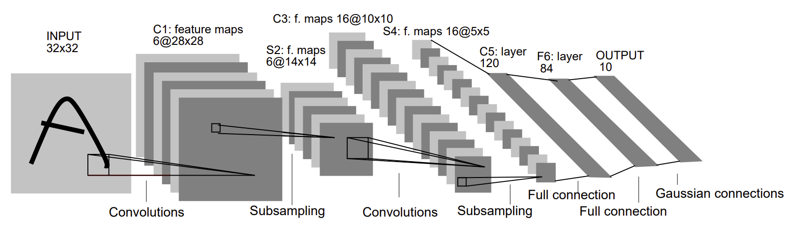

# ECE408/CS483 Final Project

## Introduction

This is the skeleton code for the Spring 2025 ECE408 / CS483 course project.

In this final project, you will be implementing and optimizing the forward-pass of a convolutional layer using CUDA. Convolutional layers are the primary building blocks of convolutional neural networks (CNNs), which are used in many machine learning tasks like image classification, object detection, natural language processing, and recommendation systems. In general, CNNs work well on tasks where the data/input features have some level of spatial relationship.

You will be working with a **modified** version of the LeNet-5 architecture shown below.

*Source: http://vision.stanford.edu/cs598_spring07/papers/Lecun98.pdf*

Your optimized CUDA implementation of the convolutional layer will be used to perform inference for layers C1 and C3 in the figure above. We will be leveraging the [mini-dnn-cpp](https://github.com/iamhankai/mini-dnn-cpp) (Mini-DNN) framework for implementing the modified LeNet-5. 

We will be using the [Fashion MNIST dataset](https://github.com/zalandoresearch/fashion-mnist), where the inputs to the network will be a batch of 10,000 single channel images, each with dimensions of 86 x 86 pixels. The output layer consists of 10 nodes, where each node represents the likelihood of the input belonging to one of the 10 classes (T-shirt, dress, sneaker, boot etc.)

The overall learning objectives for this project are:
* Demonstrating command of CUDA and optimization approaches by designing and implementing an optimized neural-network convolutional layer forward pass
* Obtaining practical experience in analyzing and fine tuning CUDA kernels through the use of profiling tools like Nsight Systems (`nsys`) and Nsight-Compute (`ncu`)

You will be working on this project individually. We will release the code for project milestones one at a time.

*You are expected to adhere to University of Illinois academic integrity standards. Do not attempt to subvert any of the performance-measurement aspects of the final project. If you are unsure about whether something does not meet those guidelines, ask a member of the teaching staff.*

## Rubric

The overall project score will be computed as follows. We will release rubric details of individual milestones together with their instructions, based on the class schedule.
So please always do `git pull` to update the project instructions.

| Milestone                   | Due                    | Score |
| --------------------------- | ---------------------- | ----- |
| [Milestone 1](README_m1.md) | March 7th, 2025 8PM | 15%   |
| [Milestone 2](README_m2.md) | April 11th, 2025 8PM | 30%   |
| [Milestone 3](README_m3.md) | May 2nd, 2025 8PM | 55%   |

## License

NCSA/UIUC © 2020 [Carl Pearson](https://cwpearson.github.io)

## Contributors

* [Carl Pearson](https://cwpearson.github.io)
* [Vikram Mailthody](https://github.com/msharmavikram/)
* Andrew Schuh
* Abdul Dakkak
* Zaid Qureshi
* Rui Lan
* Zhicun Wan
* Ben Schreiber
* James Cyriac
* Jonathan Nativ
* Shuangliang Chen
* Huili Tao
* Howie Liu
* Thomas Bae
* Yifei Song
* Shengjie Ma
